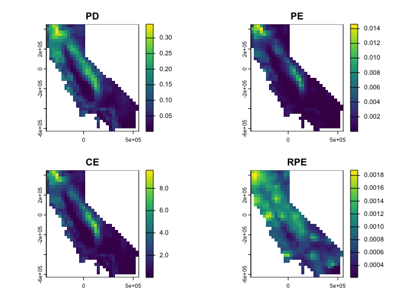

<!-- README.md is generated from README.Rmd. Please edit that file -->
<!-- badges: start -->

[](https://github.com/matthewkling/phylospatial/actions/workflows/R-CMD-check.yaml)
[](https://CRAN.R-project.org/package=phylospatial)
<!-- badges: end -->

# phylospatial <a href="https://matthewkling.github.io/phylospatial/"></a>

`phylospatial` is an R package for spatial phylogenetic diversity
analysis—accounting for evolutionary relationships among taxa when
describing biodiversity patterns. The package provides functions for
building and analyzing phylospatial data:

- `phylospatial()` constructs a spatial phylogenetic data set from
  community data and a tree.
- `ps_diversity()` calculates a range of phylogenetic diversity and
  endemism metrics.
- `ps_rand()` computes significance values for diversity metrics using
  null model randomizations.
- `ps_dissim()` calculates a pairwise community phylogenetic beta
  diversity matrix.
- `ps_ordinate()` performs a community ordination to reduce the
  dimensionality of the data set.
- `ps_regions()` clusters sites into phylogenetically similar
  biogeographic regions.
- `ps_prioritize()` performs a spatial optimization to identify
  conservation priorities.

A key feature of `phylospatial` is full support for quantitative
community data, including occurrence probabilities (e.g., from species
distribution models) and abundances, in addition to binary
presence-absence data. This avoids information loss from thresholding
continuous data, and enables new analyses not available in other spatial
phylogenetic R packages.

## Vignettes

- `vignette("phylospatial-data")` gives details about constructing
  `phylospatial` datasets with different types of data.
- `vignette("alpha-diversity")` demonstrates calculation of alpha
  phylogenetic diversity and endemism measures, including statistical
  hypothesis testing using randomization-based null models.
- `vignette("beta-diversity")` shows how to calculate phylogenetic beta
  diversity measures including nestedness and turnover, as well as
  phylogenetic ordination and regionalization to visualize phylogenetic
  community structure.
- `vignette("prioritization")` explains how to perform a phylogenetic
  conservation prioritization.

## Installation

``` r
# you can install the package from CRAN:
install.packages("phylospatial")

# or the development version from GitHub:
remotes::install_github("matthewkling/phylospatial")
```

## Quick start

``` r
library(phylospatial)
ps <- moss() # load example data
div <- ps_diversity(ps) # calculate diversity metrics
terra::plot(div)
```



## Citation

To cite `phylospatial` in publications, please use:

> Kling, M. (2025). phylospatial: an R package for spatial phylogenetic
> analysis with quantitative community data. Methods in Ecology and
> Evolution 16:1075–1083. DOI 10.1111/2041-210x.70056
