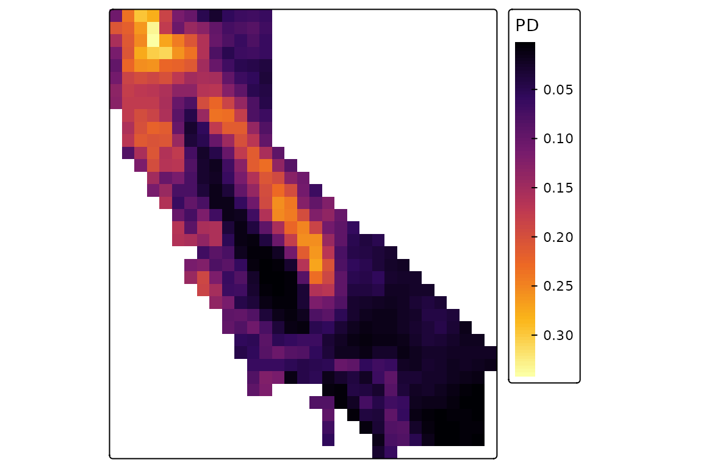
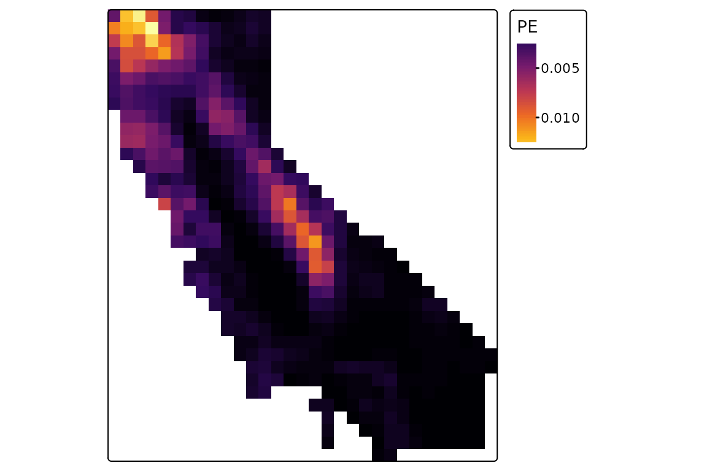
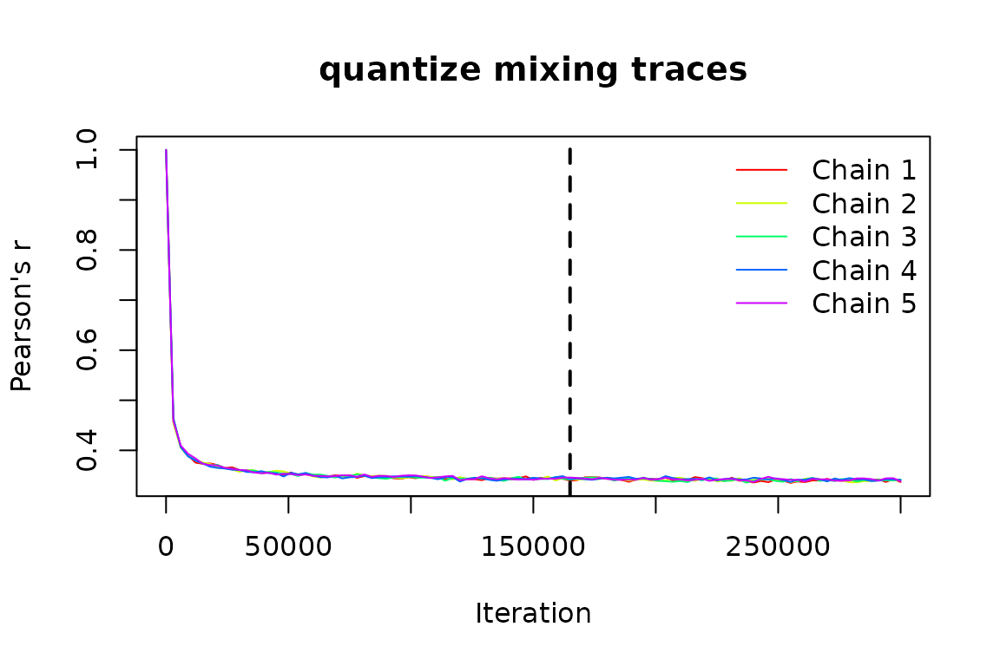
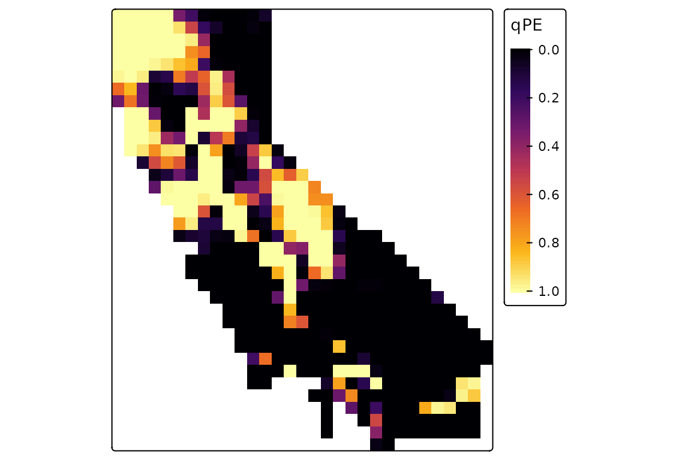
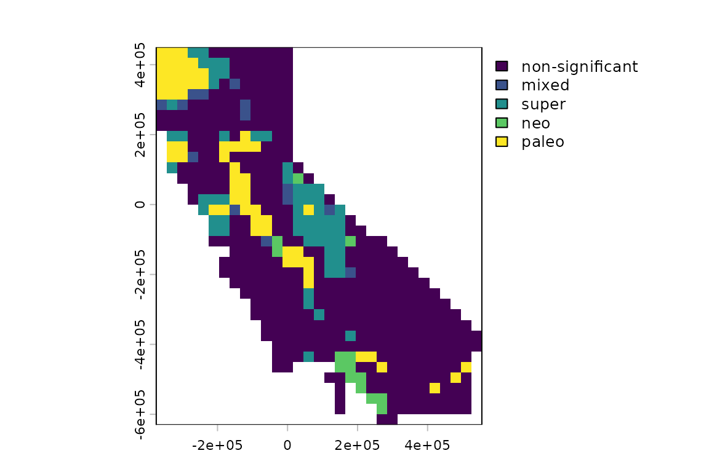

# Alpha phylogenetic diversity

This vignette covers topics related to alpha diversity and endemism,
including calculation of basic diversity metrics as well as statistical
significance testing using null randomization.

To get started, let’s load the `phylospatial` library, as well as `tmap`
for visualization. Note that the functions covered here all require a
`phylospatial` object as input; see
[`vignette("phylospatial-data")`](https://matthewkling.github.io/phylospatial/articles/phylospatial-data.md)
for details on constructing data sets. We’ll use the
[`moss()`](https://matthewkling.github.io/phylospatial/reference/moss.md)
example data here.

``` r
library(phylospatial); library(tmap)
ps <- moss()
```

## Diversity measures

The
[`ps_diversity()`](https://matthewkling.github.io/phylospatial/reference/ps_diversity.md)
function calculates the following alpha diversity measures. While there
are a wide variety of phylogentically-informed diversity metrics in the
literature, the `phylospatial` package focuses primarily on “node-based”
diversity metrics like Faith’s PD that give equal treatment to
clades/branches at all levels. Phylogenetic diversity metrics can be
categorized as addressing richness, divergence, and regularity (Tucker
et al. 2017), as listed below. Note that an alternative approach to
assessing divergence is through null model analysis of richness metrics,
discussed later in this vignette.

Richness metrics:

- PD: Phylogenetic diversity, i.e. total length of all branch segments
  present in a location
- PE: Phylogenetic endemism, i.e. endemism-weighted PD
- ShPD: Shannon’s pylogenetic diversity, a.k.a “phylogenetic entropy”
- ShPE: Shannon’s pylogenetic diversity, weighted by endemism
- SiPD: Simpson’s phylogenetic diversity
- SiPE: Simpson’s phylogenetic diversity, weighted by endemism
- TR: Terminal richness, i.e. richness of terminal taxa (in many cases
  these are species). For binary data this is the total number of
  terminals in a site, while for quantitative data it is the sum of
  probability or abundance values.
- TE: Terminal endemism, i.e. total endemism-weighted diversity of
  terminal taxa (a.k.a. “weighted endemism”)
- CR: Clade richness, i.e. richness of taxa at all levels (equivalent to
  PD on a cladogram)
- CE: Clade endemism, i.e. total endemism-weighted diversity of taxa at
  all levels (equivalent to PE on a cladrogram)

Divergence metrics:

- RPD: Relative phylogenetic diversity, i.e. mean branch segment length
  of residents (equivalent to PD / CR)
- RPE: Relative phylogenetic endemism, i.e. mean endemism-weighted
  branch length (equivalent to PE / CE)
- MPDT: Mean pairwise distance between terminals, i.e. the classic MPD
  measure
- MPDN: Mean pairwise distance between nodes, a node-based version of
  MPD that calculates the average branch length separating all pairs of
  collateral (non-lineal) nodes including terminals and internal nodes,
  giving more representation to deeper branches

Regularity metrics:

- VPDT: Variance in pairwise distances between terminals
- VPDN: Variance in pairwise distances between collateral nodes

All measures use quantitative community data if provided. “Endemism” is
the inverse of the total occurrence mass (the sum of presence,
probability, or abundance values) across all sites in the analysis. See
[`?ps_diversity`](https://matthewkling.github.io/phylospatial/reference/ps_diversity.md)
for equations giving the derivation of each metric.

Let’s compute some diversity metrics for our phylospatial data set.
Since our data is raster-based, by default the function will return a
`SpatRaster` with a layer for each measure. Here we’ll make plots of PD
and PE:

``` r
div <- ps_diversity(ps, metric = c("PD", "PE"))
tm_shape(div$PD) + 
      tm_raster(col.scale = tm_scale_continuous(values = "inferno")) +
      tm_layout(legend.outside = TRUE)
```



``` r
tm_shape(div$PE) + 
      tm_raster(col.scale = tm_scale_continuous(values = "inferno")) +
      tm_layout(legend.outside = TRUE)
```



## Null model randomization

We can also use randomization to calculate the statistical significance
of these diversity metrics under a null model, using the
[`ps_rand()`](https://matthewkling.github.io/phylospatial/reference/ps_rand.md)
function. `phylospatial` supports a wide range of randomization schemes
via the `vegan` and `nullcat` libraries. Here let’s run our
randomization using `quantize`, a stratified randomization scheme
designed for use with continuous occurrence data, in combination with a
null model algorithm called `"curvecat"`, which is a categorical version
of the “curveball” algorithm that holds marginal row and column
multisets fixed.

This is a “sequential” (Markov chain) randomization algorithm and thus
requires sufficient iterations to reach stationarity, so before running
our randomizations, we need to decide how many iterations to run each
randomization for. To get an estimate of how many iterations are
necessary for convergence based on our particular data and algorithm
choice, we can call
[`ps_suggest_n_iter()`](https://matthewkling.github.io/phylospatial/reference/ps_suggest_n_iter.md)
(importantly, using all the same parameters we plan to use for
[`ps_rand()`](https://matthewkling.github.io/phylospatial/reference/ps_rand.md)):

``` r
set.seed(123)
iters <- ps_suggest_n_iter(ps, fun = "quantize", method = "curvecat", 
                           n_iter = 3e5, plot = TRUE)
```



This suggests we need around 200,000 iterations for our matrix to mix
sufficiently, so we’ll pass that value to
[`ps_rand()`](https://matthewkling.github.io/phylospatial/reference/ps_rand.md).
Let’s generate a null distribution of `n_rand = 1000` randomized
matrices against which to compare our actual data; we can use
parallelization to speed things up by setting `n_cores`. Then we’ll plot
the results for PE. This is a quantile value that gives the proportion
of randomizations in which observed PE was greater than randomized PE in
a given grid cell. (If you wanted to identify “statistically
significant” grid cells in a one-tailed test with alpha = 0.05, these
would be cells with values greater than 0.95.)

``` r
rand <- ps_rand(ps, n_rand = 1000, progress = FALSE,
                metric = c("PD", "PE", "CE", "RPE"),
                fun = "quantize", method = "curvecat",
                n_iter = iters, n_cores = 8)
tm_shape(rand$qPE) + 
      tm_raster(col.scale = tm_scale_continuous(values = "inferno")) +
      tm_layout(legend.outside = TRUE)
```



There are numerous alternative options for randomization algorithms, a
choice that will depend on the type of occurrence data you have
(probability, binary, or abundance) and on which attributes of the
terminal community matrix (fill, row and column sums, etc.) you want to
hold fixed. In addition to the `"quantize"` function used above, these
include “`nullcat"` randomizations for binary data, a basic
`"tip_shuffle"` randomization (the default algorithm), a range of
algorithms defined in the `vegan` package `"nullmodel"` function, and an
option to supply a custom randomization function. As a second example,
here’s a randomization with an abundance data set, using the
`"abuswap_c"` algorithm provided by
[`vegan::nullmodel`](https://vegandevs.github.io/vegan/reference/nullmodel.html)
(note that since
[`ps_suggest_n_iter()`](https://matthewkling.github.io/phylospatial/reference/ps_suggest_n_iter.md)
doesn’t work with `vegan`, we need to set `n_iter` arbitrarily):

``` r
ps2 <- ps_simulate(data_type = "abundance")
rand2 <- ps_rand(ps2, fun = "nullmodel", method = "abuswap_c", metric = "PD", 
                 n_iter = 1e6, n_rand = 999)
```

## Spatially constrained randomization

Standard null models treat all sites as exchangeable, meaning that
species can be shuffled between any pair of sites regardless of how far
apart they are. This may not be ecologically realistic: species are more
likely to co-occur at nearby sites than distant ones. Spatially
constrained null models address this by weighting the randomization so
that exchanges occur more frequently between nearby sites. Weights can
be continuous or binary and can reflect geographic proximity,
environmental similarity, presence in discrete geographic regions, or
other spatial properties.

Weighting is available for `fun = "quantize"` (for quantitative data)
and `fun = "nullcat"` (for binary data), but not for `fun = "vegan"`
methods. For eligible methods, the `wt_row` argument to
[`ps_rand()`](https://matthewkling.github.io/phylospatial/reference/ps_rand.md)
accepts a square weight matrix controlling which pairs of sites are
likely to exchange species during randomization. A natural choice is a
distance-decay function of geographic distance, which can be computed
using
[`ps_geodist()`](https://matthewkling.github.io/phylospatial/reference/ps_geodist.md);
the choice of decay function and bandwidth will affect the strength of
the spatial constraint, and should be based on the spatial scale of
ecological processes in the study system. The code below demonstrates
weight matrix construction for a few common shapes of decay function
(Gaussian, exponential, threshold), and also for a scheme involving
isolated subregions (e.g. islands) that never exchange species. Note
that adding weights generally increases the value of `n_iter` needed for
convergence.

``` r
# Weight matrices for several alternative distance functions
geo <- as.matrix(ps_geodist(ps_bin)) / 1000 # distance in km
W <- dnorm(geo, sd = 100) # Gaussian decay w0th 100 km SD
W <- exp(-geo / median(geo)) # exponential kernel
W <- (geo < 200) + 0 #  hard distance threshold

# Weights matrix for discrete isolated regions
island <- sample(1:5, nrow(ps$comm), replace = T)
W <- (as.matrix(dist(island)) == 0) + 0

# Spatially constrained randomization
iters <- ps_suggest_n_iter(ps_bin, fun = "nullcat", method = "curvecat", n_iter = 3e5)
rand_spatial <- ps_rand(ps_bin, fun = "nullcat", method = "curvecat", n_iter = iters, 
                        n_rand = 1000, metric = c("PD", "PE"),
                        wt_row = W)
```

## CANAPE

A lot can be done with randomization results like the ones we generated
above. One thing you can do is use them to classify significant endemism
hotspots in a “categorical analysis of neo- and paleo-endemism” (CANAPE,
[Mishler et al. 2014](https://doi.org/10.1038/ncomms5473)). The function
[`ps_canape()`](https://matthewkling.github.io/phylospatial/reference/ps_canape.md)
uses significance values for PE, RPE, and CE, which are returned by
[`ps_rand()`](https://matthewkling.github.io/phylospatial/reference/ps_rand.md),
to categorize sites into five endemism cateogories. Here’s an example
with the moss data; note that depending on the randomization, only a
subset of the five categories may occur in the result here:

``` r
cp <- ps_canape(rand, alpha = .05)
terra::plot(cp)
```


