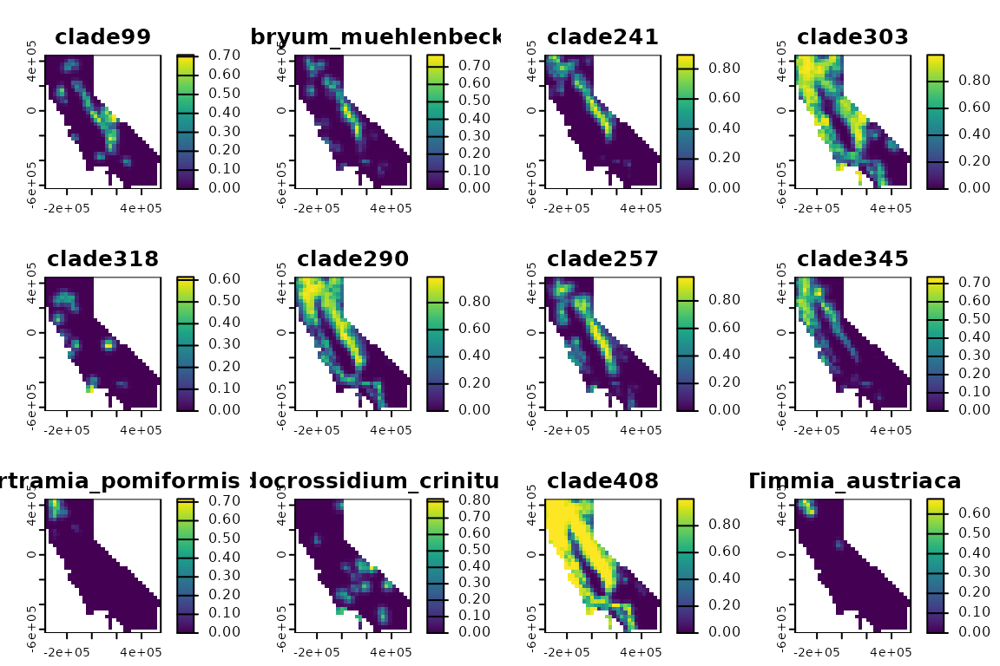

# Spatial phylogentic data

## Introduction

This vignette demonstrates the basic structure and creation of a spatial
phylogenetic data set, which is the first step of any analysis using
this R package. Spatial phylogenetic analyses require two essential
ingredients: data on the geographic distributions of a set of organisms,
and a phylogeny representing their evolutionary relationships. This
package stores these data as objects of class `'phylospatial'`.

The core idea of spatial phylogenetics is that analyses account for
every every single “lineage” on the phylogenetic tree, including
terminals and larger clades. Each lineage has a geographic range
comprising the collective ranges of all terminal(s) in the clade, and it
has a single branch segment whose length represents the evolutionary
history that is shared by those terminals and only those terminals. When
calculating biodiversity metrics, every lineage’s occurrence in a site
gets weighted by its branch length.

In this vignette, we’ll create a lightweight example of a `phylospatial`
object, look through its components to understand how it is structured,
and then demonstrate some more nuanced use cases with real data.
Finally, we’ll show how `phylospatial` objects can also be used for
traditional non-phylogenetic biodiversity data analyses, in cases when
incorporating a phylogeny is impossible or undesirable.

## A minimal example

Let’s begin by creating a simple `phylospatial` object. To do this, we
use the
[`phylospatial()`](https://matthewkling.github.io/phylospatial/reference/phylospatial.md)
function, which has two key arguments: `tree`, a phylogeny of class
`phylo`, and `comm`, a community data set representing the geographic
distributions of the terminal taxa (usually species). In the code below,
we simulate a random tree with five terminal taxa, and a raster data set
with 100 grid cells containing occurrence probabilities for each
terminal, with layer names corresponding to species on the tree. (A
differentiating feature of the `phylospatial` library is that it
supports quantitative data types like probabilities or abundances, in
addition to binary community data.) Then we pass them to
[`phylospatial()`](https://matthewkling.github.io/phylospatial/reference/phylospatial.md):

``` r
library(phylospatial); library(terra); library(ape); library(sf)

# simulate data
set.seed(1234)
n_taxa <- 5
x <- y <- 10
tree <- rtree(n_taxa)
comm <- rast(array((sin(seq(0, pi*12, length.out = n_taxa * x * y)) + 1)/2, 
                   dim = c(x, y, n_taxa)))
names(comm) <- tree$tip.label

# create phylospatial object
ps <- phylospatial(comm, tree)
ps
#> `phylospatial` object
#>   - 8 lineages across 100 sites
#>   - community data type: probability 
#>   - spatial data class: SpatRaster 
#>   - dissimilarity data: none
```

## Structure of a `phylospatial` object

#### Phylogeny

Our `phylospatial` object is a list with six elements. Let’s look at
each of these in turn, starting with the `tree`. This is the phylogeny
we simulated, a tree of class `phylo` with 5 tips and 3 larger clades.
Note that the branch lengths of the input tree are scaled to sum to 1.
We can use
[`plot()`](https://rspatial.github.io/terra/reference/plot.html)
function to view the tree.

``` r
names(ps)
#> [1] "comm"      "tree"      "spatial"   "data_type" "clade_fun" "dissim"

ps$tree
#> 
#> Phylogenetic tree with 5 tips and 4 internal nodes.
#> 
#> Tip labels:
#>   t5, t4, t3, t1, t2
#> 
#> Rooted; includes branch length(s).

plot(ps, "tree")
```


#### Community matrix

The other key component is `comm`, which is a `matrix` containing
occurrence data. Although we supplied community data as a raster, it’s
stored here as a matrix, with a row for each grid cell and a column for
each taxon. Let’s take a look at the matrix. We can also `plot` the
community data, which re-casts it as a spatial data set (a raster, in
this case).

``` r
head(ps$comm)
#>         clade1    clade2        t5         t4    clade3          t3         t1
#> [1,] 0.9980319 0.9889042 0.5000000 0.97780849 0.8226247 0.781536164 0.18807934
#> [2,] 0.9953701 0.9919546 0.8428239 0.94881279 0.4245239 0.421627315 0.00500815
#> [3,] 0.9997640 0.9997100 0.9991060 0.67560320 0.1861159 0.104363637 0.09127841
#> [4,] 0.9517871 0.9194606 0.8838080 0.30684210 0.4013750 0.002378797 0.39994761
#> [5,] 0.9172596 0.5786829 0.5596673 0.04318460 0.8036150 0.171166120 0.76305863
#> [6,] 0.9936764 0.2254502 0.2030598 0.02809548 0.9918358 0.518882839 0.98303074
#>              t2
#> [1,] 0.03467274
#> [2,] 0.28671168
#> [3,] 0.65480785
#> [4,] 0.93866795
#> [5,] 0.98383430
#> [6,] 0.76573040

plot(ps, "comm")
```


We can see that in addition to our 5 terminal taxa, the data set also
includes geographic ranges for the 3 larger clades. Internally, the
[`phylospatial()`](https://matthewkling.github.io/phylospatial/reference/phylospatial.md)
function constructs ranges for every multi-tip clade on the tree, based
on the topology of the tree and the community data for the tips.

The specific way that these clade ranges are constructed depends on the
type of community data being used. The package supports three data
types: `"probability"`, `"abundance"`, and `"binary"`. Recall that our
data were probabilities; we could have specified that explicitly by
setting `data_type = "probability"` when we constructed our phylospatial
object, but the function detected this based on the values in our data
set, and we can confirm that it did so correctly by checking
`ps$data_type`. For probabilities, the default function used to
calculate clade occurrence values gives the probability that at least
one member of the clade is present in a given site. Abundance and binary
data have their own default functions. (You can also override the
defaults by supplying your own `clade_fun`—for example, if you had
occurrence probabilities that you knew were strongly non-independent
among species, you could specify `clade_fun = max`.) The function that
was used for a given data set can be accessed at `ps$clade_fun`.

Note that you can also specify your own clade ranges to
[`phylospatial()`](https://matthewkling.github.io/phylospatial/reference/phylospatial.md)
rather than letting it build them for you, by setting `build = FALSE`.
You might want to do this if, for example, you have modeled the
distributions of every clade in addition to every terminal species in
your data set.

#### Spatial data

The `spatial` component is the last key piece of our phylospatial
object. (The only other element we haven’t mentioned here is `dissim`,
which is covered in the vignette on beta diversity.) The spatial
component of the object contains spatial reference data on the
geographic locations of the communities found in each row of the
community matrix.

In this example, the spatial data is a raster layer inherited from the
`SpatRaster` data we supplied as our `comm`. You can also supply vector
data (points, lines, or polygons) as an `sf` object. If the spatial data
is in raster, polygon, or line format, `phylospatial` will check that
all features have equal area or length, which is an important assumption
underlying various functions in the package.

Also note that spatial data isn’t required; community data provided as a
matrix works just fine.

## A realistic example

Now let’s look at creating a phylospatial data set using real data. To
do this, we’ll use the example “moss” data set that ships with the
package, representing a phylogeny and modeled occurrence probabilities
for several hundred species of moss in California. The function
[`moss()`](https://matthewkling.github.io/phylospatial/reference/moss.md)
returns a pre-constructed `phylospatial` object based on these data, but
here let’s build one from scratch. In the code below we’ll load a raster
data set with a layer of occurrence probabilities for each species, and
a phylogeny representing their evolutionary relationships. We’ll then
pass these to
[`phylospatial()`](https://matthewkling.github.io/phylospatial/reference/phylospatial.md).

``` r
moss_comm <- rast(system.file("extdata", "moss_comm.tif", package = "phylospatial"))
moss_tree <- read.tree(system.file("extdata", "moss_tree.nex", package = "phylospatial"))
ps <- phylospatial(moss_comm, moss_tree)
plot(ps, "comm")
```



``` r
plot(ps, "tree", type = "fan", show.tip.label = FALSE)
```


#### Non-phylogenetic data

While the `phylospatial` library is obviously designed for phylogenetic
analyses, it’s worth noting that it also supports non-phylogenetic
analyses. In cases where a phylogeny is unavailable or where a
traditional species-based biodiversity analysis is desired, you can
create a data set by calling
[`phylospatial()`](https://matthewkling.github.io/phylospatial/reference/phylospatial.md)
without providing a tree. All major functions in the package will still
work, and will assume that the taxa in `comm` are independent and
equally weighted.

In fact, traditional species-based methods can actually be considered a
specific case of more general phylogenetic methods, in which species are
assumed to be connected on a “star” phylogeny with a single polytomy and
equal branch lengths. In `phylospatial`, support for non-phylogenetic
data is implemented by creating a star phylogeny if no phylogeny is
provided by the user. Here’s how this looks for the simple community
data we created above:

``` r
ps <- phylospatial(comm)
plot(ps, "tree", type = "fan")
```


